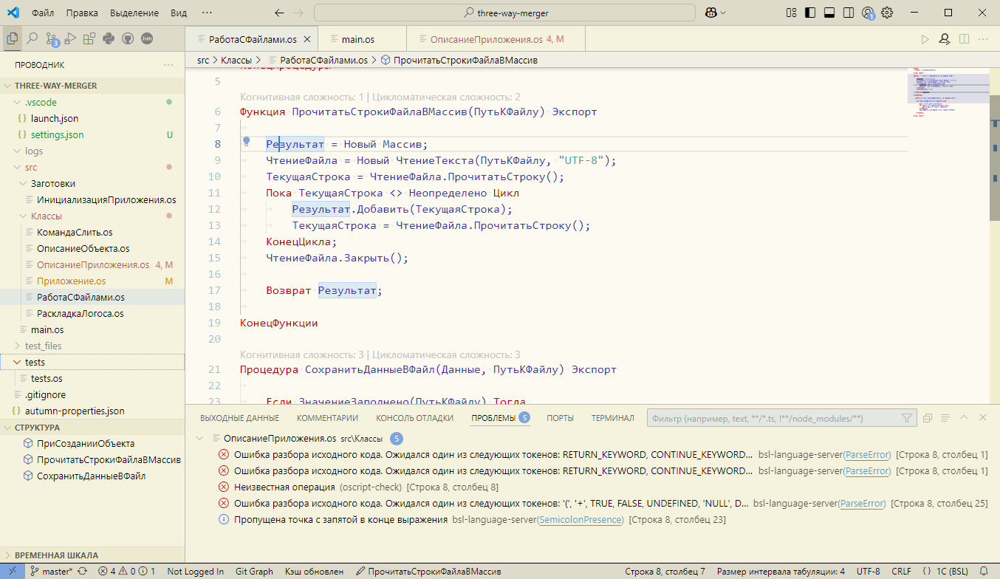
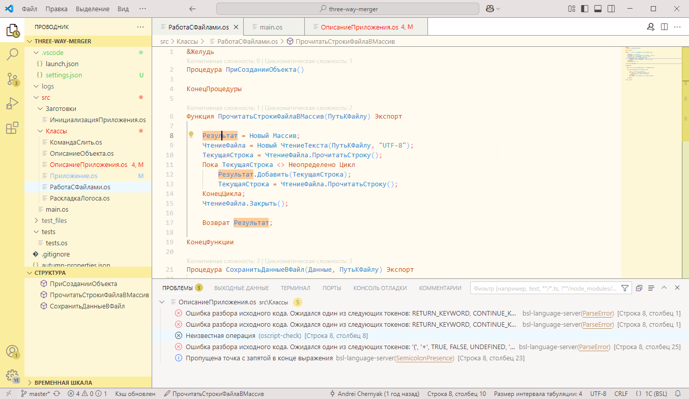
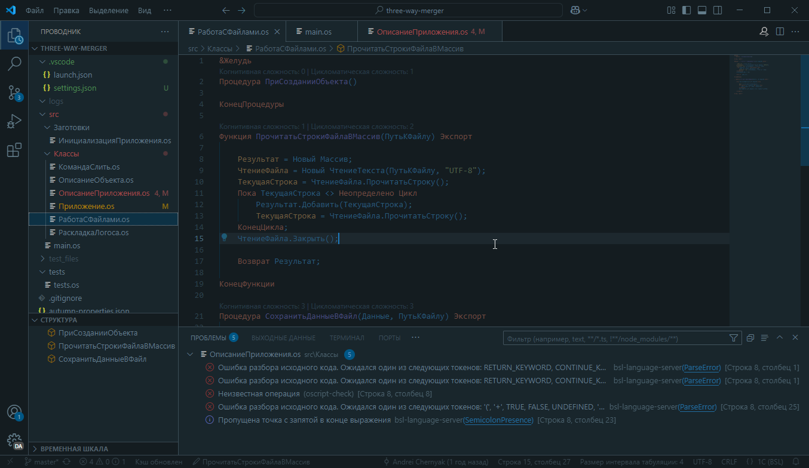

# vscode-onec-theme

Темы оформления для Visual Studio Code разработанные по мотивам различных расцветок вокруг да около платформы 1С:Предприятие.

Подсветка синтаксиса встроенного языка 1С:Предприятие и [OneScript](http://oscript.io/), а также языка запросов 1С:Предприятие - при наличии установленного плагина [vsc-language-1c-bsl](https://marketplace.visualstudio.com/items?itemName=1c-syntax.language-1c-bsl).
Подсветка синтаксиса в файлах `xbsl` и `sbsl` - при наличии плагина [vscode-xbslplugin](https://github.com/bia-technologies/vscode-xbslplugin) (официальный плагин [1C:Executor](https://marketplace.visualstudio.com/items?itemName=1c-soft.1c-executor-plugin) тоже подойдёт).

## Примеры

OneC Light:

OneC Yellow:

OneC Dark:

## Установка

### 1. Вручную из файла расширения

1. Скачайте расширение со страницы [релизов](https://github.com/ChernyakAI/vscode-onec-theme/releases).
2. В Visual Studio Code нажмите на значок "Расширения" (Extensions) в левой части окна
3. В открывшейся панели расширений в верхней части нажмите на "..." и выберите из выпадающего списка "Установка из VSIX(Install from VSIX)
4. После установки перейдите Файл -> Настройки -> Тема -> Цветовая тема (File -> Preferences -> Theme -> Color Theme)
В появившемся меню выберите необходимый вариант.

### 2. Из магазина приложений

1. В Visual Studio Code перейдите на вкладку "Расширения"
2. В окне поиска введите "OneC Theme"
3. Установите расширение
4. Выберите необходимый вариант
